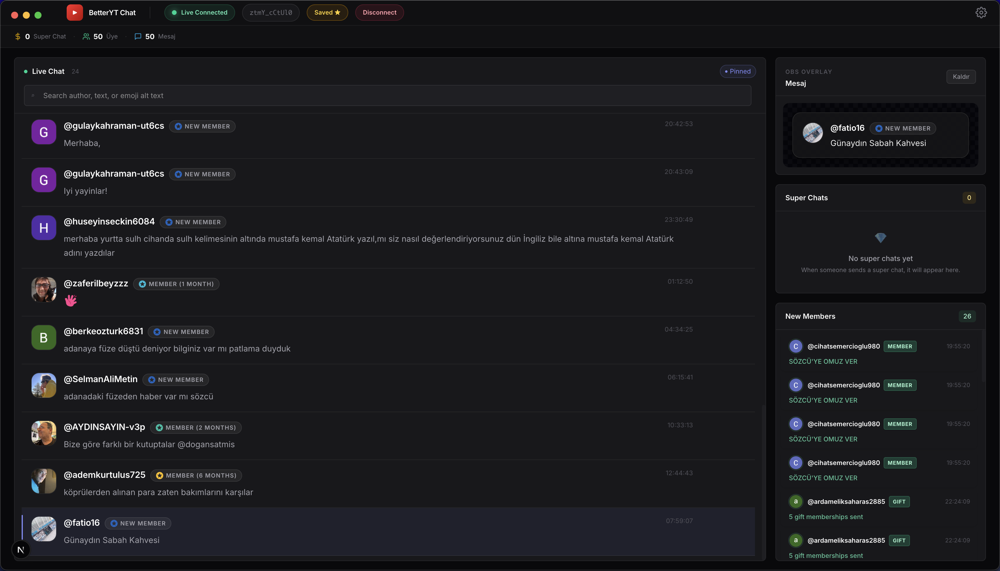
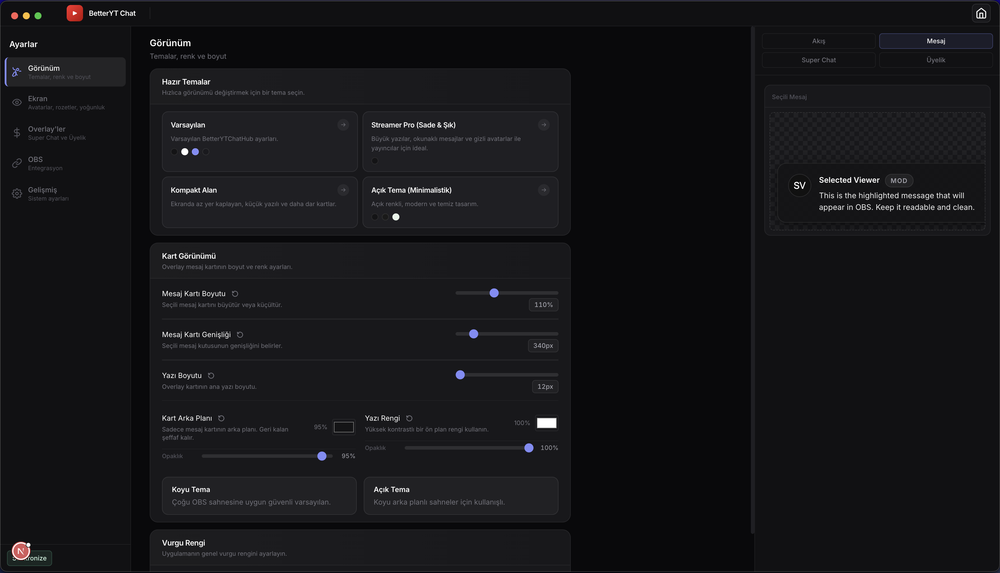
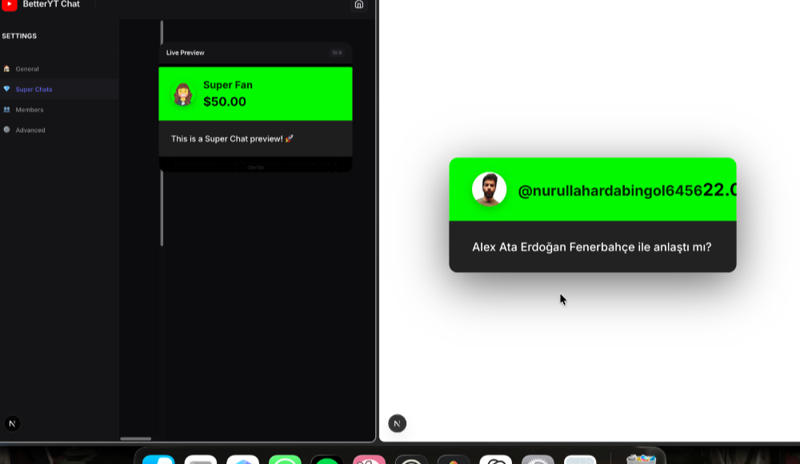
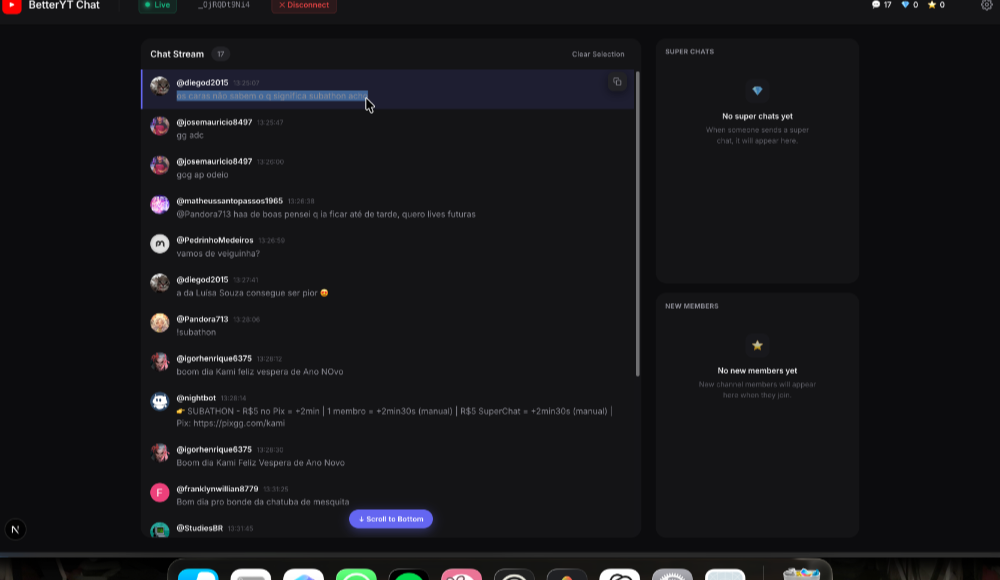

# BetterYTChatHub

BetterYTChatHub is a desktop-style YouTube Live chat control room for streamers who want faster moderation, cleaner message handling, and OBS-ready overlays without relying on the default YouTube chat UI.

It combines a Next.js operator dashboard, a Fastify backend, and shared typed settings to deliver:

- a searchable live chat feed
- one-click message pinning
- dedicated super chat and member rails
- live overlay routes for OBS
- a synced settings system with workspace-level customization

## Why This Exists

The default YouTube chat panel is not built for production workflows. It is fine for casual browsing, but weak for:

- quickly spotting important messages
- routing a message to stream graphics
- handling super chats and memberships separately
- keeping a clean operator view open for hours

BetterYTChatHub solves that by turning chat into a real control surface.

## What You Get

### Operator Dashboard

- Searchable moderation feed
- One-click pinning to overlay
- Super chat queue
- Member event queue
- Visual selection states
- Smart auto-scroll that pauses when the operator scrolls up
- Desktop-style command-deck layout

### Overlay System

- Main overlay route for selected messages
- Dedicated super chat overlay
- Dedicated members overlay
- SSE-driven live updates
- Smooth switching transitions
- Independent scale, placement, and styling controls

### Settings System

- Live auto-save
- Shared `AppSettings` model across all routes
- `localStorage` persistence
- Cross-tab sync with `BroadcastChannel`
- Workspace controls for:
  - frame mode
  - density
  - activity rail width
  - accent color
  - ambient glow
  - badge visibility
  - selection preview visibility

### Message Support

- Standard messages
- Super chats
- Super stickers
- Membership announcements
- Gift memberships
- Moderator / member / verified badges
- Leaderboard rank badges
- Live poll presence indicator

## Screenshots

| Feature | Preview |
| --- | --- |
| **Dashboard** |  |
| **Settings** |  |
| **Overlay** |  |
| **Super Chat** |  |
| **Members** |  |
| **Message Selection** |  |

## Tech Stack

| Layer | Technology |
| --- | --- |
| Frontend | Next.js 15, React 19, TypeScript |
| Backend | Fastify, `youtubei.js`, SSE |
| Shared models | TypeScript via `@shared/*` |
| Styling | Tailwind CSS v4 + project CSS tokens/components |

## Current Product State

This repository can run either as a browser-based web app or inside the committed Electron desktop shell.

The desktop shell now includes platform-aware window chrome: native traffic lights on macOS and renderer-managed caption buttons on Windows/Linux.

## Routes

When running locally:

| Route | URL |
| --- | --- |
| Dashboard | `http://localhost:3000/dashboard` |
| Settings | `http://localhost:3000/settings` |
| Main overlay | `http://localhost:3000/overlay` |
| Super chat overlay | `http://localhost:3000/superchat` |
| Members overlay | `http://localhost:3000/members` |
| Backend health | `http://localhost:4100/health` |

## Quick Start

### Requirements

- Node.js 20+
- `pnpm` recommended

### Install

```bash
pnpm install
```

### Run In Development

```bash
pnpm dev
```

This starts:

- the frontend on port `3000`
- the backend on port `4100`

### Build

```bash
pnpm build
```

### Start Production

```bash
pnpm start
```

## Real YouTube Live Setup

To start in live mode automatically, provide `YOUTUBE_LIVE_ID`.

Example `.env`:

```bash
YOUTUBE_LIVE_ID=YOUR_VIDEO_ID
```

If `YOUTUBE_LIVE_ID` is missing, the backend falls back to mock mode so the UI still works during development.

## Project Structure

```text
backend/       Fastify API + YouTube Live ingestion
client/        Next.js dashboard, settings, and overlay routes
shared/        shared TypeScript models
memory-bank/   project context and engineering notes
ScreenShots/   repo screenshots
```

## Architecture Overview

1. The backend connects to YouTube Live chat through `youtubei.js`
2. Incoming actions are normalized into shared message types
3. The dashboard polls chat state and posts selection changes
4. Overlay pages consume live selection updates over Server-Sent Events
5. Settings persist locally and sync across routes and tabs

## Useful Commands

```bash
pnpm dev
pnpm dev:electron
pnpm build
pnpm build:client
pnpm build:backend
pnpm build:electron
pnpm electron:dist
pnpm start
```

## Troubleshooting

### Port Already In Use

If you see `EADDRINUSE`, another process is already holding the port.

Check:

```bash
lsof -i :3000
lsof -i :4100
```

Then stop the conflicting process and run:

```bash
pnpm dev
```

### `.next` ENOENT Or Missing Page Files

If you get errors such as:

- `client/.next/server/app/settings/page.js`
- `routes-manifest.json`
- `pages-manifest.json`

your Next dev cache is likely in a bad state.

Fix:

```bash
rm -rf client/.next
pnpm dev
```

Do not run `next build client` and `next dev client` against the same worktree at the same time.

### `youtubei.js` Parser Warnings

YouTube sometimes changes internal response structures. Some `youtubei.js` parser warnings are noisy but non-fatal if chat connection still succeeds.

### Mock Mode

If the backend logs that `YOUTUBE_LIVE_ID` is missing, that is expected behavior in local development. The app will generate mock data instead of live chat.

## Contribution Notes

- Keep shared models aligned across `client`, `backend`, and `shared`
- Prefer `pnpm`
- If you change settings behavior, verify dashboard + overlays together
- If you touch UI layout, check both desktop and smaller window widths

## Roadmap Direction

- stronger live-chat resilience against upstream YouTube schema drift
- deeper workspace theming and preset support
- persistent storage beyond in-memory session state
- harden desktop packaging and native-shell behavior across macOS, Windows, and Linux

## License

MIT
